## Predicting Crime & Safety
# Los Angeles Crime Data Analysis and Visualization
**Author**: [Al-Amin Hossain](mailto:alamin.hossain.cs@gmail.com) 

 
## Overview
This project explores the patterns of crime in Los Angeles(LA), using the dataset from the Los Angeles Police Department (LAPD) spanning from 2020 to the present. The primary focus was to analyze the criminal activities and understand if LA is safe to visit for new tourists. 

The project provides a multifaceted view of urban criminal activity by focusing on various aspects of crime, such as geographical hotspots, crime count monthly and yearly trends, demographic, age, and gender impacts, and the nature of offenses. A significant part of the study involved identifying areas with the highest crime rates. The analysis revealed a few places as the most crime-prone areas. It also discovered the months with the highest crime incidence and the days and times when crimes peaked. The study also indicates the victim's group according to age, color, and sex. This insight is crucial for developing targeted social interventions and preventive measures. Moreover, the study observed the nature of crime, premises, and weapon types.

 A key component of the study was the application of machine learning models to predict crime counts in upcoming days. Tested and evaluated multiple models to find the perfect fit. This project has an immense scope. This could be helpful for general people to know about LA’s crime pattern. Law enforcement authorities could be aware of the hot spots and prepare with necessary precautionary measures. Overall, the study not only paints the crime patterns it also describes the potential uses of the data analysis and predictive modeling for a safe society.

 ## Repository Contents

```bash

├── data                                          # contains raw data and map helper json
├── visualizations                                # contains visualization graphs and images
├── data_cleaning.ipynb                           # used to clean `Crime_Data_from_2020_to_Present.csv`
├── data_loading.ipynb                            # used to load the collected data
├── Presentation_Slides_Al-Amin_Hossain.ppsx      # presentation slide
├── Project_Code_Al-Amin_Hossain.ipynb            # final version of project (feature engineering, Visualization, Modeling process)
├── Project_Report_AL-Amin-Hossain.pdf            # project report
└── README.md                                     # preview for the repo

```

## Research Questions
This project tries to inform people about crime and safety in Los Angeles by analyzing the reported incidents. At first, I carefully prepared a few questions that would answer

1. which areas of LA have the highest crime?

2. which months are most crime-prone, which day of the week, and which time of the day?

3. is there any connection between crime count, age, and sex of the victims?

4. how much crime has fluctuated in the last 3 years, which type of crime mostly occurs, which premises
the crime occurs most, and what kind of weapons are mostly used for crime?

5. what are the top 3 impacted demographics in LA?

## Data Collection
For this project, I have collected the data from the Los Angeles Police Department (LAPD) official website. This dataset is open for all and they keep it updated every alternate week. I have taken the dataset ["Crime Data from 2020 to Present"](https://data.lacity.org/Public-Safety/Crime-Data-from-2020-to-Present/2nrs-mtv8/about_data), which reflects the crime incidents in Los Angeles dating back to 2020. The downloaded data was last updated on September 11, 2023. It has 798242 rows and 28 columns consisting of the victim’s age, sex, descent, weapon used for the crime, location of crime with latitude and longitude, etc. The data provided in this dataset is numeric and string. Each row belongs to each reported incident. Data in each instance belong to different areas of the City of Los Angeles.

## Answers with Visualization
**1. which areas of LA have the highest crime?**

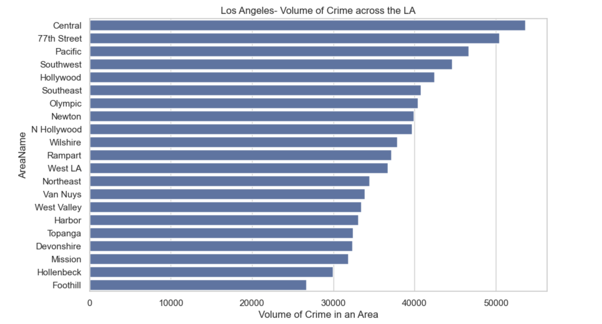

Here we can see, the top 5 areas where most of the crimes in LA have occurred. Those are Central, 77th Street, Pacific, Southwest, and Hollywood.


The dark red color describes the most crime-occurred area, light red is the second highest, dark yellow is the third highest, light yellow is the fourth, and lighter yellow is the fifth highest.

**2. which months are most crime-prone, which day of the week, and which time of the day?**

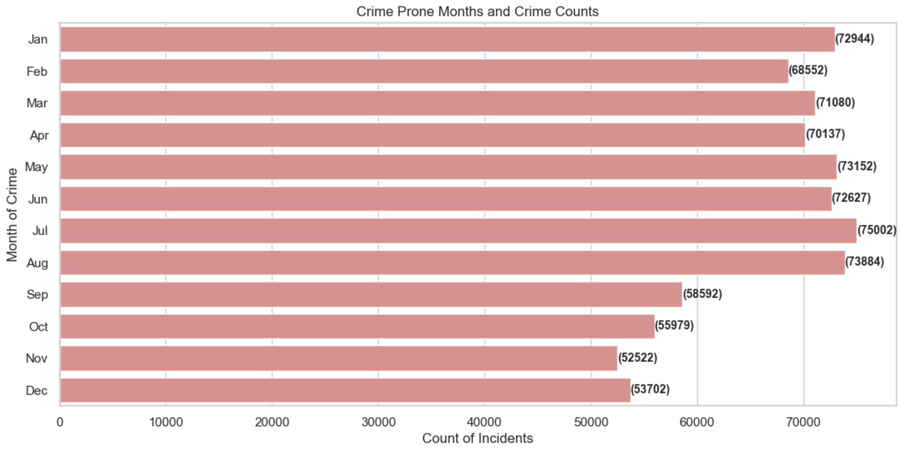

July and August have the highest crime occurrence count. In contrast, we can observe that November and December have the lowest Crime incidents count.

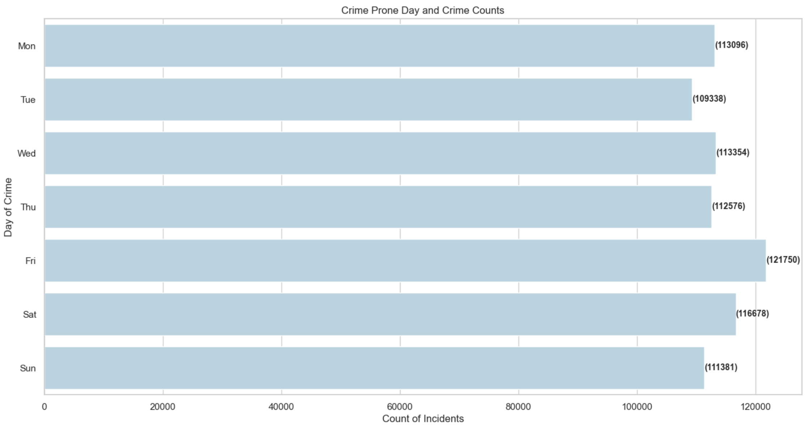

The figure shows that Friday has the highest and Tuesday has the lowest crime count.

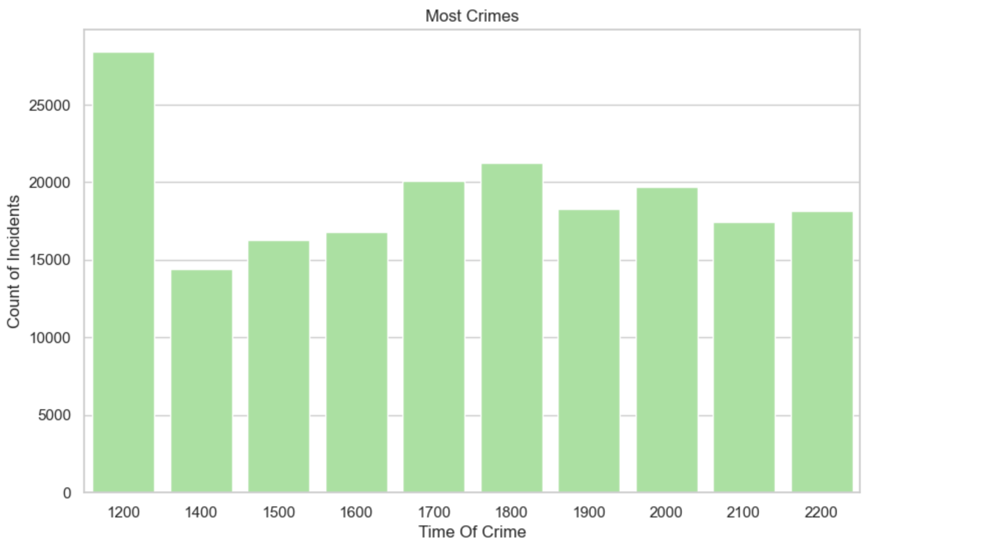

The plot shows the hours of the day when most crimes occur. We can see a very strange thing! Crime occurs mostly at 1200 hours. Why would someone commit a crime so much in the middle of the day, rather than at night? So, we find out when the least crime occurs and what type of crime occurs most at noon hour.

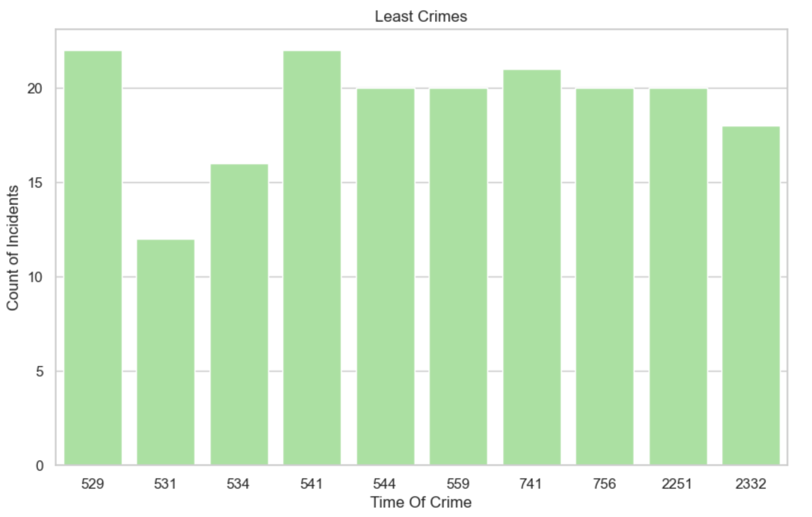

The crime occurrence count is least at 700 hours. Is it because people have woken up and getting ready for the crime? This is interesting.

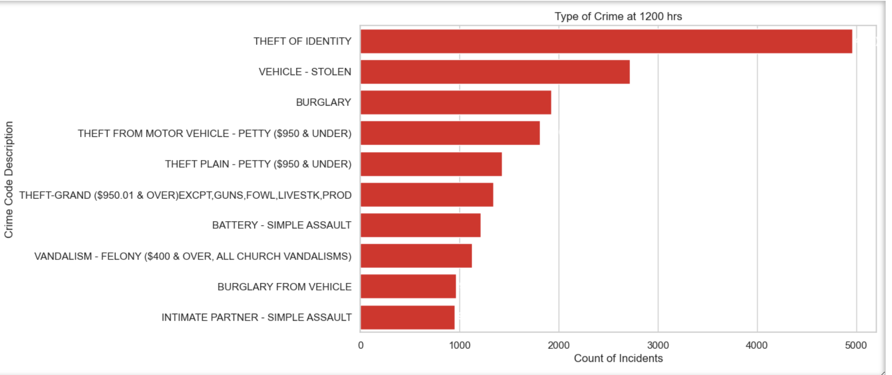

The figure shows that Theft of Identity is the most common crime type that happened during noon time.

**3. is there any connection between crime count, age, and sex of the victims?**

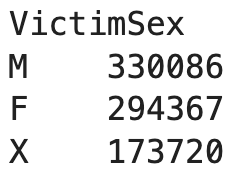

From the table, we can say that Males are the most victims according to this collected dataset. There is a probability that Females could exceed the count of males if we could figure out the unknown portion. The possibility of vice versa is also there.

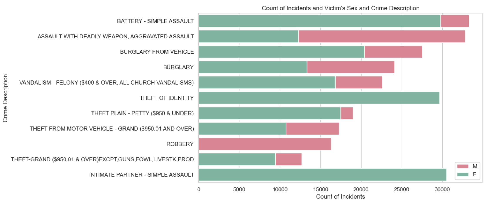

We can see that Females are the only victims of Intimate Partner-Simple Assault and Theft of Identity. On the other hand, Robbery has only male victims.

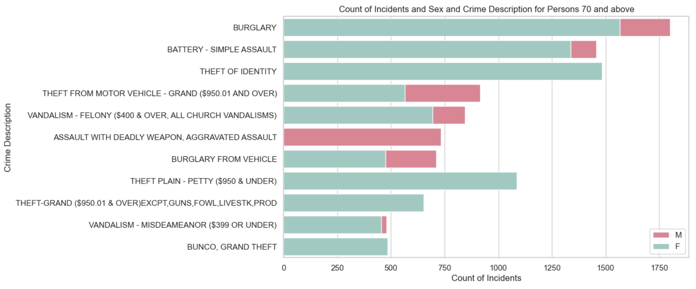

We observe that Burglary is the most occurred crime committed by persons aged 70 and above.

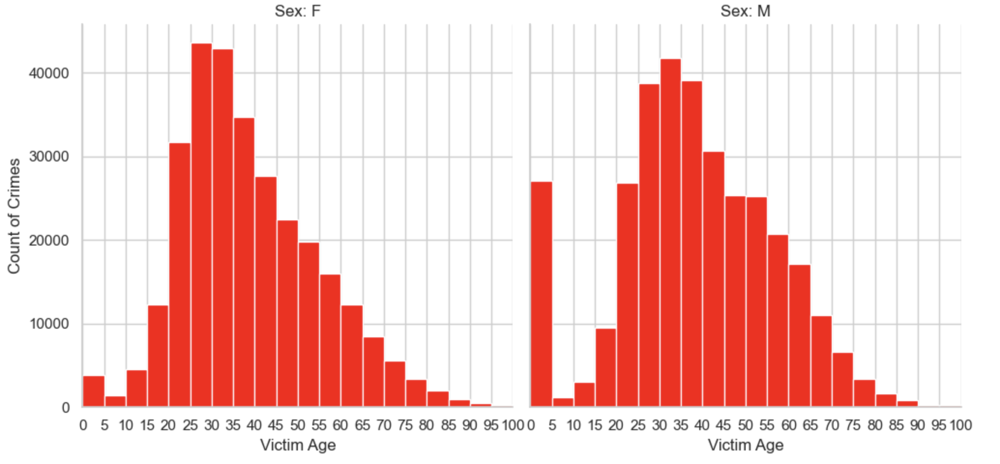

According to the figure, most victims are around the age of 25 to 30. It proves that Females are victimized more than males in the age group 25 to 30.

**4. how much crime has fluctuated in the last 3 years, which type of crime mostly occurs, which premises the crime occurs most, and what kind of weapons are mostly used for crime?**

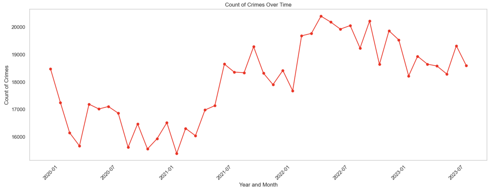

From the line graph, we can see that the crime count dropped in the months of 2020. Probably, it happened because people were inside due to covid situation. Later, crime started to increase in 2021. We can see that 2022 has the highest crime count. Till September 2023 the crime count is still lower than 2022 and there is a low chance to increase as the most crime- prone months July and August have already passed.

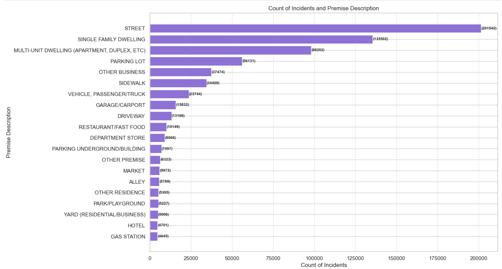

According to figure Street(201542), Single Family Dwellings (135502), Multi-Unit Dwellings (98202), and Parking lots(56131) are the top four places for Crimes.

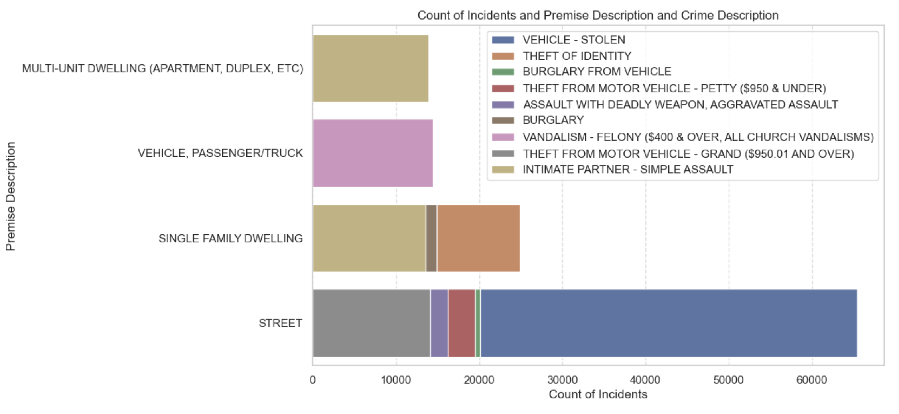

We can see the Stolen Vehicle, Theft from Motor Vehicle and Burglary from Vehicle are most common Crime Types on Street(which is the most crime occurred place)

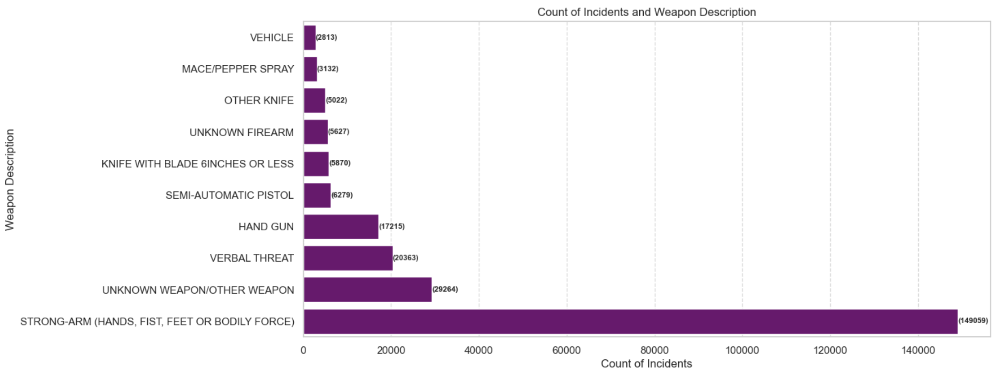

We can observe that No weapon has been used for most of the crimes. This also means that most of the crimes are not directly life-threatening.

**5. what are the top 3 impacted demographics in LA?**

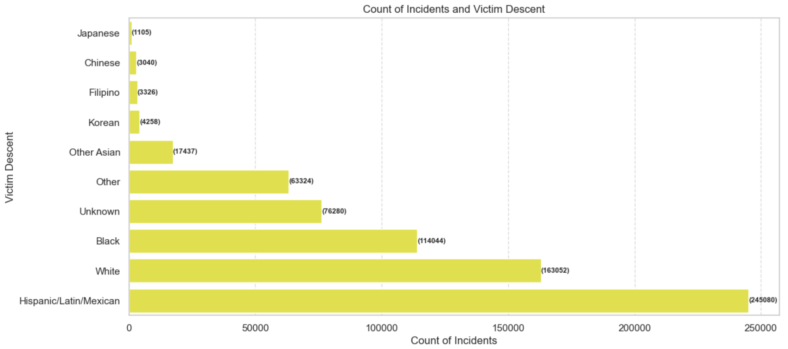

For all the crimes reported from January 2020 to September 2023, Latin(245080) is the highest victim of crimes, White (163052) is the second highest and Black(114044) is the third. So, it seems 31% are of Latin descent, 20% are white and 14% are black.

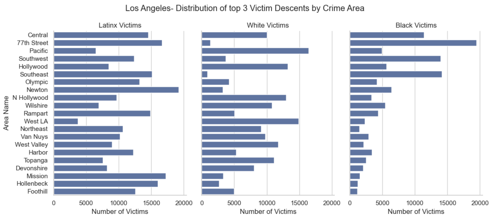

Looking at the top 3 vulnerable demographics in LA, Black, and Latinx communities have suffered in the highest crime- occurring areas of 77th Street and Southeast. This could also be that fewer white people are living in these two areas. White victims are highest Pacific area, West LA, and Hollywood, this could be because these areas have higher white populations. Similarly, areas such as Mission, Newton, Rampart, Foothill, and Hollenbeck have a higher number of Latinx victims than the other descents.

## Few Extra Viualizations
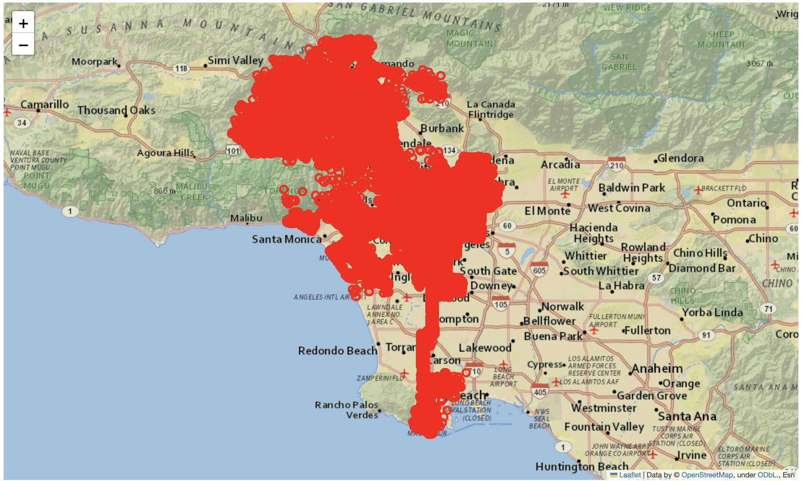

The map shows the exact locations where the crime occurred.

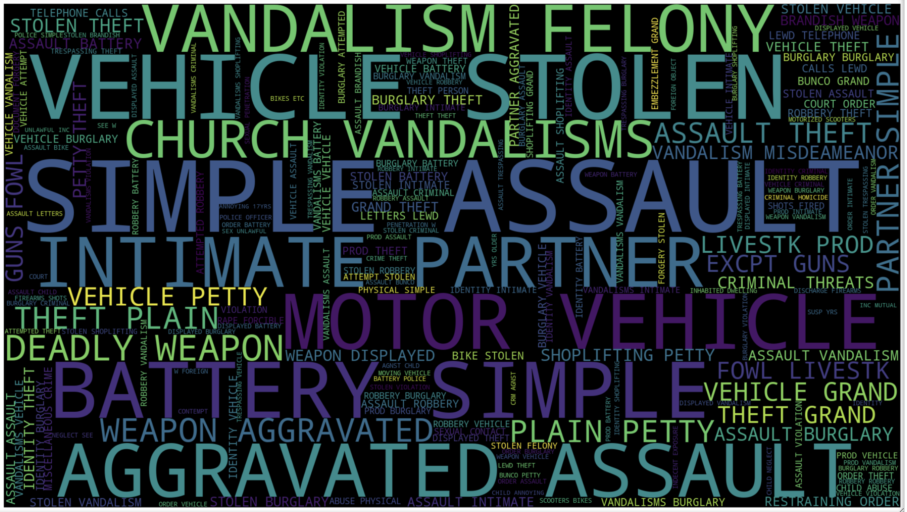

The word cloud showing the mostly occurred crimes.

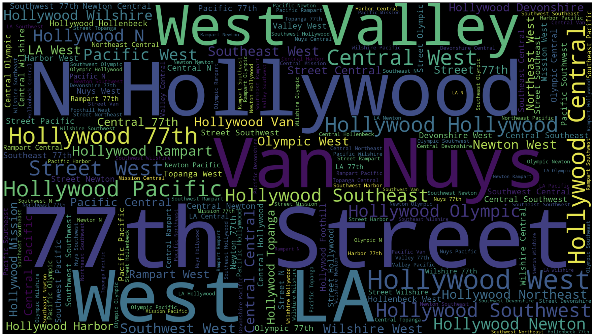

The word cloud showing the mostly crime prone areas.

## Crime Count Prediction Using Machine Learning

I fitted the data in Linear Regression, Autoregressive, Moving Average, and Autoregressive Integrated Moving Average. Calculated the MAE, MSE, and RMSE for each model. Table III shows the result of each model’s MAE, MSE, and RMSE.

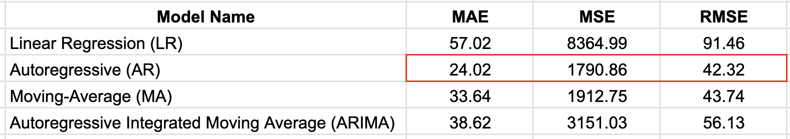

All the evaluation metrics are the calculation of Error. So, the less will indicate the better model. From the figure, we can see the MAE, MSE, and RMSE values of the Autoregressive model are 24.02, 1790.86, and 42.32 respectively, which are the lowest compared to the rest of the models. We can see that the Autoregressive model will be the best fit for the collected dataset to predict the count of crime for each day.

## Recommendations

Based on the visualization results and predictions, it is evident that Central, 77th Street and Pacific are the top three areas where crime occurred and was reported, based on LAPD incident reports from January 2022 to September 2023. The majority of street-related crimes are associated with vehicles, emphasizing the importance of vigilance regarding personal belongings when in these areas. Additionally, individuals in the age group of 25-30, both male and female, should exercise increased caution when visiting LA.

A recommended precautionary measure involves the Los Angeles Police Department deploying more units near locations with significant Latin and Black communities. Moreover, the LAPD should enhance readiness during July and August, identified as the months with the highest incidence of crime.

It is noteworthy that a significant proportion of crimes in LA occurs without the use of firearms, suggesting a lower direct threat to life. In summary, LA can be considered safe for visits by taking precautionary measures and being aware of the surrounding conditions.

## Future Work
The future work aims to further elevate the predictive capabilities of our analytics system by incorporating advanced models, specifically focusing on the implementation of the Prophet Model. Additionally, the study will explore the impact of different features on model performance and conduct ongoing evaluations with incoming data.